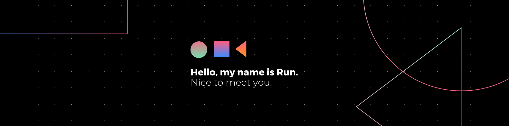

<h2 align="center">This is where I'm supposed to bombard you with a plethora of geeky names of languages, but the inner rebel is coming out... So why don't we start with you first?</h2>
<h3 align="center"> It feels like you ...<h3>

- 👍🏼 ...Are looking for someone with a 'Can do, Will do' attitude

- 👊🏼 ...Believe that good people are found, not trained

- 🙏🏼 ...Want someone who takes ownership of themselves to join your team

- 👉🏼 ...Laughs when you see a sophicated resume knowing coop students have only been coding for 3 days

 Okay, so ...

The bad news is... sure, I've only had one term of studying. But the good news is, hey isn't that amazing how much you can learn within such a short period of time? And in a school setting! Imagine bringing that drive and absorbent mindset into the real world. As an employer, you can bet your bottom dollar on your ROI.

 Okay, but what do you know though?

  
<h3 align="left">Languages and Tools:</h3>

                   

&nbsp;

Check out more projects down below🔽

  

